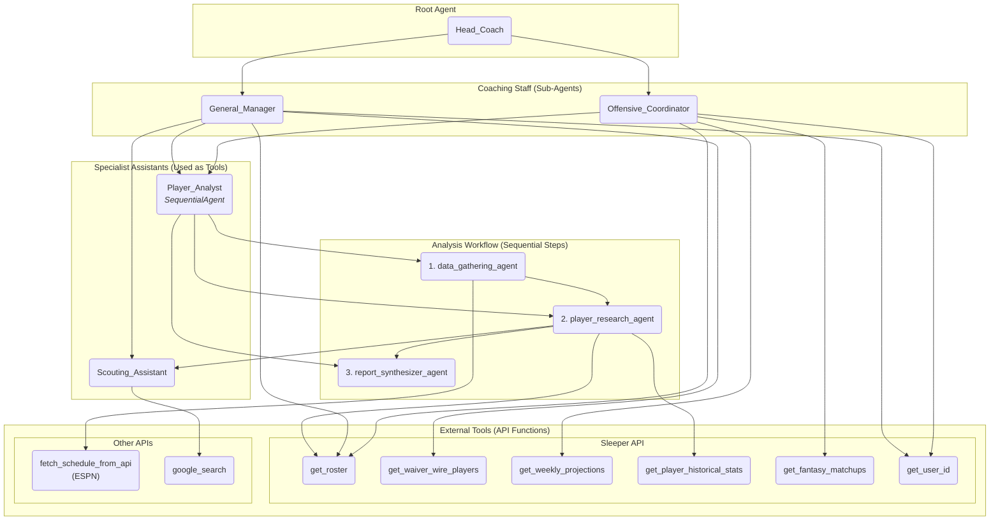

# **NFL Fantasy League Bot**

This repository contains a multi-agent system built with the [Google Agent Development Kit (ADK)](https://google.github.io/adk-docs/) to provide expert analysis and recommendations for your NFL fantasy football team. The bot connects to the official [Sleeper API](https://docs.sleeper.com/) for real-time league data.

## **Features**

* **Optimal Lineup Strategy**: Get a detailed recommendation for the best starting lineup for the week, including your bench.  
* **In-Depth Player Analysis**: Receive a comprehensive report on key players, analyzing their performance from the current and two previous seasons.  
* **Waiver Wire Recommendations**: Discover the top available players on the waiver wire to strengthen your roster for the long term.

## **Agent Architecture**

The application is structured like a professional NFL coaching staff, with a root Head\_Coach agent that delegates tasks to a team of specialized assistants.

* **Head\_Coach**: The main interface for the user. It understands your request and delegates it to the appropriate sub-agent.  
* **Offensive\_Coordinator**: Focuses on short-term, weekly strategy. It analyzes your roster, projections, and specific fantasy matchups to suggest the optimal lineup.  
* **General\_Manager**: Focuses on long-term strategy. It analyzes the waiver wire and provides recommendations for player acquisitions.

### **Architecture Diagram**

This diagram visualizes how the agents, sub-agents, and tools are interconnected.


## **Installation & Setup**

1. **Clone the Repository**:  
   ```
   git clone \<your-repo-url\>  
   cd nfl-fantasy-league-bot
   ```

2. Create a Virtual Environment:  
   It is highly recommended to use a virtual environment to manage project dependencies.  
   ```
   python \-m venv venv  
   source venv/bin/activate  \# On Windows, use \`venv\\Scripts\\activate\`
   ```

3. **Install Dependencies**:  
   ```
   pip install \-r requirements.txt
   ```

4. Set Up Environment Variables:  
   Create a .env file in the root of the project by copying the example file.  
   ```
   cp .env.example .env
   ```
   Open the .env file and add your Sleeper.com username and the ID of your fantasy league.  
   SLEEPER\_USERNAME="your\_username"  
   LEAGUE\_ID="1234567890"

## **Usage**
    Run the application using the Google ADK's built-in web server. From the root directory, run the following command:

    ```
    adk web nfl\_fantasy\_league\_bot
    ```

    Navigate to the local URL provided in your terminal. You can now interact with the Head\_Coach agent in the web interface. Start by providing your Sleeper username and league ID when prompted.